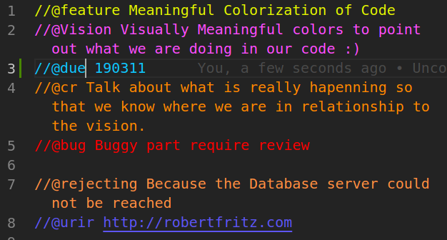

# Intentions #

* Structure your thinking for an optimal innovative orientation.
* Form a resemblant of an underlying structural tension while coding by marking(decorating) your intentions, observations, questions, state and see an interesting visual representation.

## Preview
 


##  Dekos table  ##

| Deko  | Name   | Goal  | Note   | Synonym   |
|---|---|------------------------|---|---|
|  @v | Vision   | A result we want  | Recognizable sentence you can get the picture and say, I have reached that!  |  @vision,@g,@goal | 
|  @a | Action  | A phase/step in a plan to reach a goal  | Intermediary result to Vision that lined up you get the vision realized.  Goes with a @v  |  @action |
|  @o | Observation  | Point an observation  |   | @Observation  |
|  @cr | Current Reality  | Picture where you are in relationship to the vision (@v)  |   |  @s,@currentreality |
|  @sta | Status  | Same as @cr  | I use it to state what is hapenning in code in contrast to @cr which is more charting related to vision (@v)  |  @cr,@state,@status |
|  @q | Question  | A Question to create tension  | Useful to give the mind a thing to do  | @question  |
|  @issue | Issue  |  Describe an Issue |   | @problem, @problematic  |
|  @context | Context | Describe the context in any doc | | |
|  @concept | Concept | Highlight a  concept | | |
|  @hyp | Question  | An hypothesis   | For researcher | @hypothesis, @stchyp  |
|  @startuml | UML  | see PlantUML   |   |   |
|  @startmc | Start a MasterChart  | MasterChart description   |   |   |
|  @mc | State a MasterChart goal  |   | Top level goal might help another action so you can see the whole hierarchy  | @MasterChart  |
|  @data | About Data | Specific to data | @fields | |
|  @fields | Data props  |  Ennumerate data props | @fields GoalText,DueDate,Note  |   |
|  @bug | Bug  |  Describe a bug |   | @issue  |
|  @prereq | Prerequisit  |  Describe a prerequisite |   | @STCPrereq  |
|  @test | testing  |  Describe a test |   | @tst  |
|  @insight | Insight  |  Describe an insight |   | @i  |
|  @due | Due Date  |  Describe when you want that done |   | @d  |
|  @mastery | Mastery  |  Describe a desired mastery |   | @m,@mastering   | 
|  @promise | Promise class  |  Describe a desired promise class resolution |   | @p   |
|  @resolving | Promise class resolving  |  Describe a desired promise class resolution |   | @res,@resolution,@to_resolve ,@resolved  |
|  @rejecting | Promise class rejection  |  Describe a desired promise class rejection |   | @rejection,@reject,@to_reject,@rejected   |
|  _ | Separate code with visual  |  //_   Different colored  |   | ...   |
|  - | Separate code with visual  |  //-----Nice separator----- |   | ...   |
|  ###... | Contrasted visual separator  |  //#### separator----- |   | ...   |


# OTHER RESOURCES


## Structural Thinking
* Know more on Structural Thinking :
 Fritz Structural Thinking : http://guillaumeisabelle.com/r/structural-thinking/stc-deko-readme


## STC Deko Tree

* Also try : 
 GuillaumeIsabelle.deko-tree-overviewing https://marketplace.visualstudio.com/items?itemName=GuillaumeIsabelle.deko-tree-overviewing


___

---

# thanks to: aaron-bond from which this was based - inspired from Better Comments


## Configuration

This extension can be configured in User Settings or Workspace settings.


`"deko-comments.multilineComments": true`  
 This setting will control whether multiline comments are styled using the annotation tags.
 When false, multiline comments will be presented without decoration.

`"deko-comments.highlightPlainText": false`  
This setting will control whether comments in a plain text file are styled using the annotation tags.
When true, the tags (defaults: `! * ? //`) will be detected if they're the first character on a line.

`deko-comments.tags`  
The tags are the characters or sequences used to mark a comment for decoration.
The default 5 can be modifed to change the colors, and more can be added.
```json
"deko-comments.tags": [
  {
    "tag": "!",
    "color": "#FF2D00",
    "strikethrough": false,
    "backgroundColor": "transparent"
  },
  {
    "tag": "?",
    "color": "#3498DB",
    "strikethrough": false,
    "backgroundColor": "transparent"
  },
  {
    "tag": "@v",
    "color": "#FF8C00",
    "strikethrough": false,
    "backgroundColor": "transparent"
  }
]
```

## Supported Languages

* Ada
* AL
* AsciiDoc
* C
* C#
* C++
* Clojure
* COBOL
* CoffeeScript
* CSS
* Dart
* Dockerfile
* Elixir
* Erlang
* F#
* Fortran
* gdscript
* Go
* GraphQL
* Groovy
* Haskell
* Haxe
* HiveQL
* Handlebars
* HTML
* Java
* JavaScript
* JavaScript React
* JSON with comments
* Julia
* Kotlin
* LaTex (inlc. Bibtex/Biblatex)
* Less
* Lisp
* Lua
* Makefile
* Markdown
* Nim
* MATLAB
* Objective-C
* Objective-C++
* Pascal
* Perl
* Perl 6
* PHP
* Pig
* PlantUML
* PL/SQL
* PowerShell
* Puppet
* Python
* R
* Racket
* Ruby
* Rust
* SAS
* Sass
* Scala
* SCSS
* ShaderLab
* ShellScript
* SQL
* STATA
* Stylus
* Swift
* Tcl
* Terraform
* Twig
* TypeScript
* TypeScript React
* Verilog
* Visual Basic
* Vue.js
* YAML

